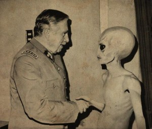
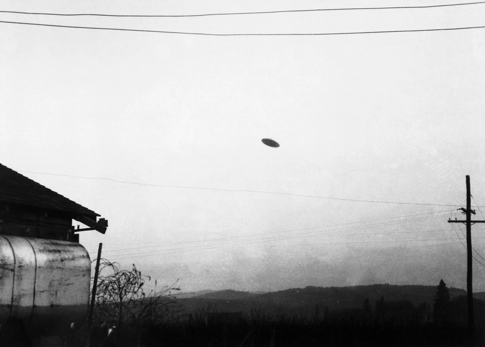
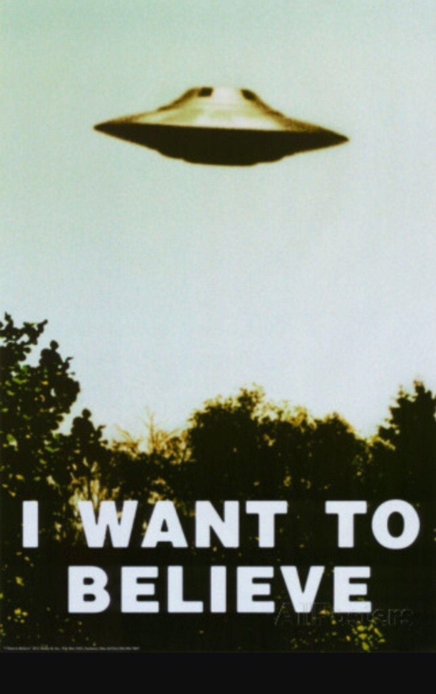

# **Existuje mimozemský život?**

(mimozemšťané)

---

# Základní otázky

Opakování dělení

* Perm (před 200 milióny let)

---
# Základní informace

* 

---

## Fermiho paradox

Paradox Fermiho zdůrazňuje záhadný rozpor mezi vysokou pravděpodobností existence pokročilého mimozemského života a absencí konkrétního důkazu.

---

# Historické Perspektivy

* Zachování dodnes

---

# Podmínky pro život

---

# Extrémní prostředí na Zemi

---

# Závěr a diskuze

* můj názor
* myslíte si vy že existují mimozemšťané?

