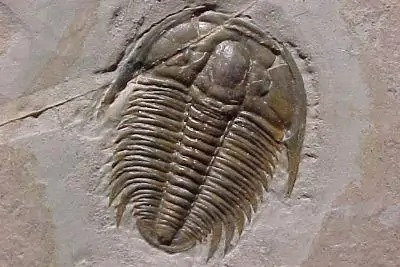
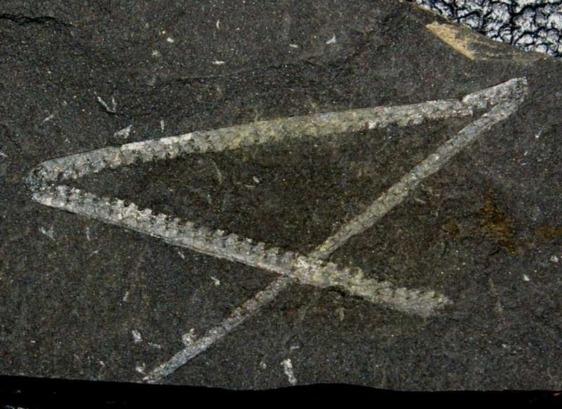
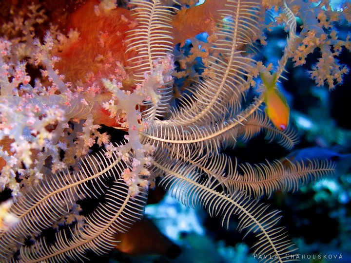
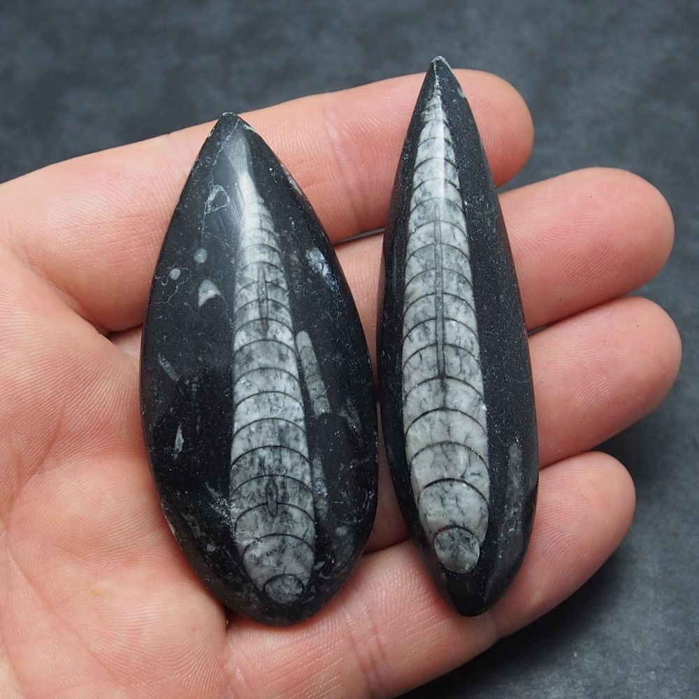
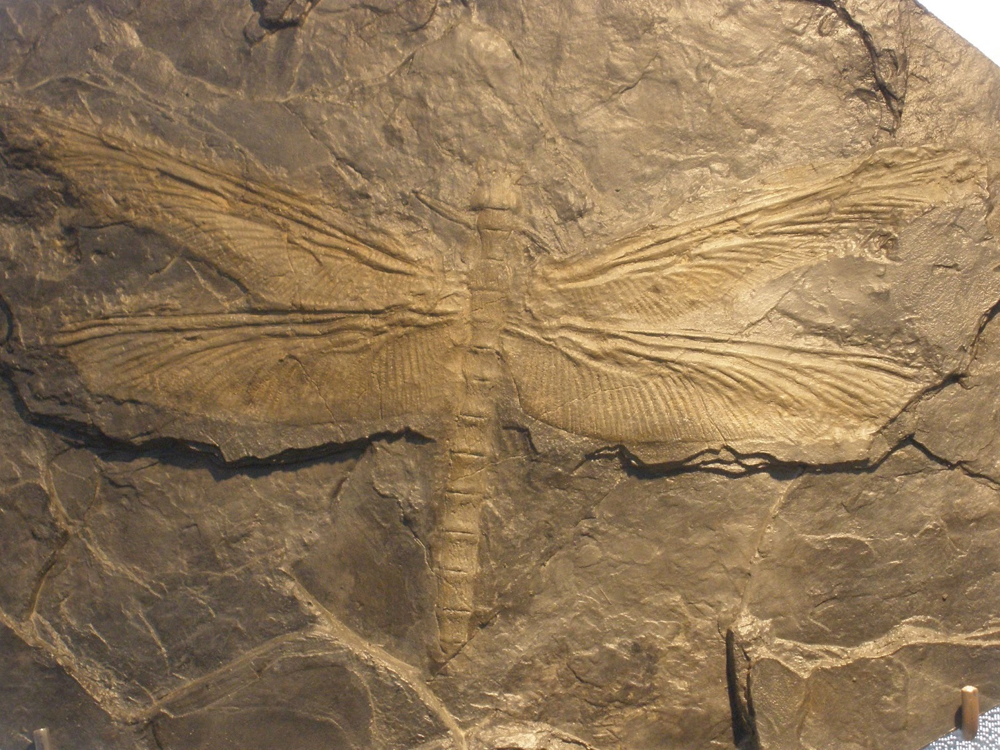
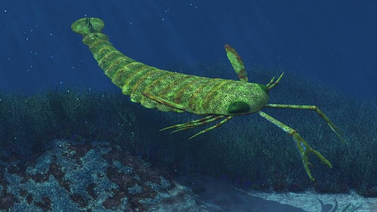
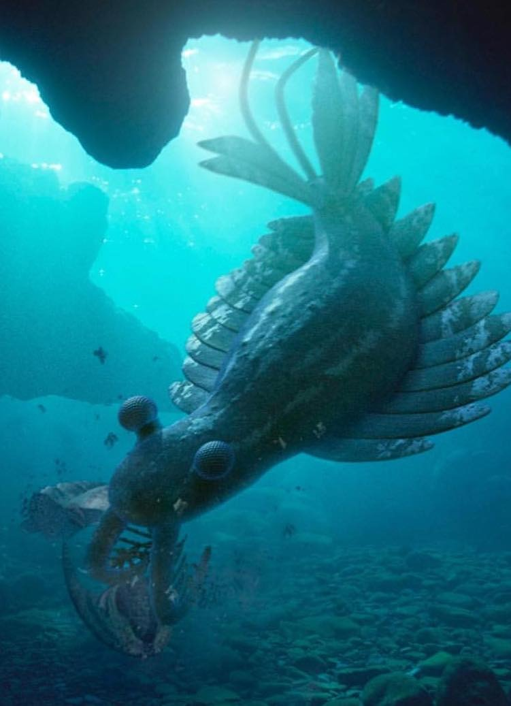

# **Zajímaví bezobratlí živočichové prvohor**

Trilobiti, Graptoliti, Lilijice, Meganeura, Pterygotus, Anomalocaris

---

# Prvohory

Opakování dělení

* Perm (před 200 milióny let)
* Karbon (před 345 milióny let)
* Devon (před 395 milióny let)
* Silur (před 445 milióny let)
* Ordovik (před 500 milióny let)
* Kambrium (před 570 milióny let)

---
# Trilobiti

* Život
* Potrava
* Velikost
* Proč trilobit?
* Zařazení
* Objevení
* Potomci v dnešní době

---

# Graptoliti

* Kolonie
* Množství
* Dělení
* Rozpoznávání stáří hornin

---

# Lilijice

* Zachování dodnes
* Živočich se stonkem?
* Velikost
* Rozdíl od hvězdic
* Vnější smysly

---

# Orthoceras

* Velikost
* Pohyb
* Sběratelská oblíbenost

---

# Meganeura

* Rozpětí křídel
* Potrava
* Rychlost
* Charles Brongniart

---

# Pterygotus

* Výskyt
* Délka
* Význam v paleontologii
* Vrchol potravní pyramidy

---

## Anomalocaris

* Neobvyklost
* Problémy při jeho klasifikaci
* Lovec trilovitů
* Nekompletní nálezy

---