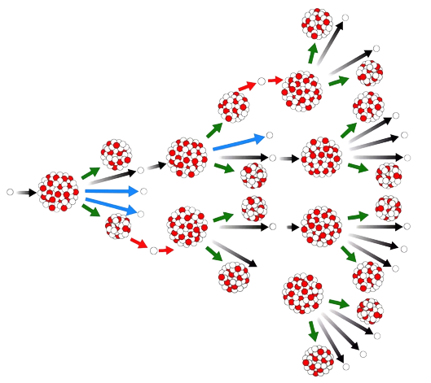
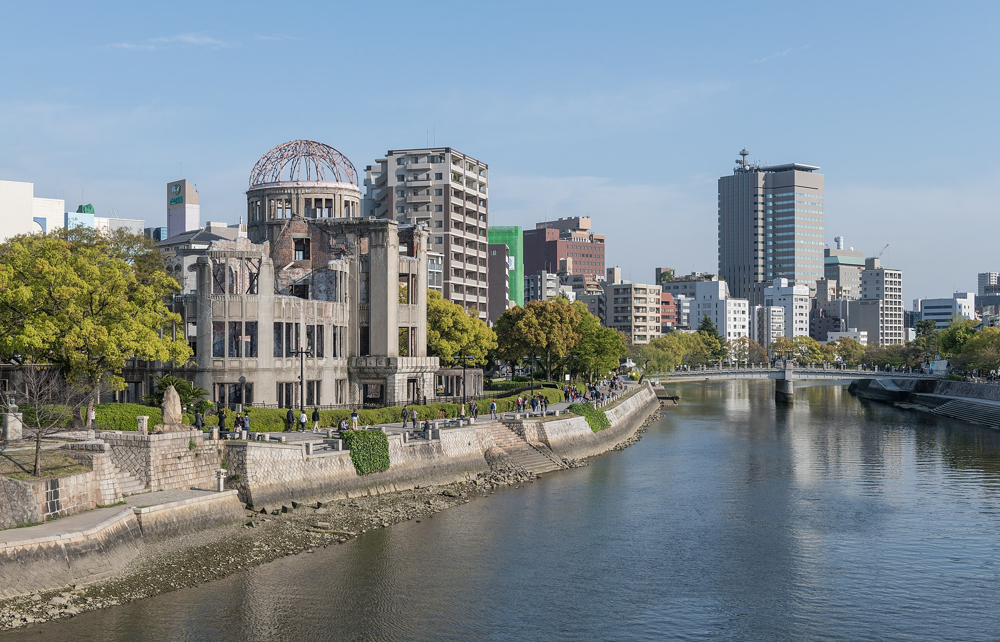

# **Jaderné zbraně**

Štolba, Valenta, Fluger, Kroupa, Kaduch

```
“Když zář tisíců sluncí vybuchne na obloze, 
bude to jak nádhera toho nejmocnějšího. Stávám se smrtí, ničitelem světů.”
- Robert Oppenheimer
```

---

# Vývoj atomové bomby

* Projekt Manhattan
* Oppenheimer
* Síla jaderné zbraně


---

# Fungování jaderné bomby

* Řetězová reakce
* Přeměna hmoty na energii (E=mc²)
* [Následky atomové bomby](https://youtu.be/5iPH-br_eJQ?t=48)



---

# Využití při 2. Sv. Válce

* Testy jaderných zbraní
* Atomové útoky na Hirošimu a Nagasaki
* Tsutomu Yamaguchi



---

# Studená válka

* Vzájemně zaručené zničení
* Hodiny soudného dne (Doomsday Clock)
* Kubánská raketová krize
* Stanislav Petrov


---

# Situace v dnešní době

* Jaderné velmoci
* Riziko konfliktu
* Následky jaderné války


```
“Nevím, jakými zbraněmi bude třetí světová válka vedena,
ale čtvrtá světová válka bude vedena klacky a kameny.”
- Albert Einstein
```

---

# Zajímavé odkazy na doma

* [Vyzkoušejte si svržení jaderné zbraně](https://nuclearsecrecy.com/nukemap/)
* [Restaurace záběrů z testů trinity - 1945](https://www.youtube.com/watch?v=wki4hg9Om-k)
* [Americké testy apple 2 a operace Cue - 1955](https://www.youtube.com/watch?v=ztJXZjIp8OA&list=PLAuMPNKYgHgUMLBNMcKOh5Y20TsU_lsjr&index=0)
* [Záběry svržení ruské Car bomby - 1961](https://www.youtube.com/watch?v=YtCTzbh4mNQ&list=PLAuMPNKYgHgUMLBNMcKOh5Y20TsU_lsjr&index=0)
* [Anime vyobrazení svržení little-boy na město Hiroshima - 1983](https://www.youtube.com/watch?v=P2g9QZvHTuk&list=PLAuMPNKYgHgUMLBNMcKOh5Y20TsU_lsjr&index=0)

---

# Zpětná vazba

děkujeme za pozornost