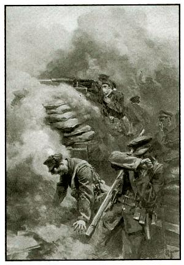

# Jedovaté plyny

Valenta, Fluger

* Využití v každodenním životě 
* Historické využití  
+složení 

---

# Využití v každodenním životě

* Čpavek
* Formaldehyd
* Oxid uhličitý
* Oxid uhelnatý
* Oxid siřičitý

---

# Čpavek

* lehčí než vzduch
* poškozuje sliznici
* výroba dusíkatých hnojiv, čistidel, trhavin

---

## Formaldehyd

* karcinogen
* E240
* výroba pryskyřice, hnojiv, papírů, izolací
* problém s dýcháním, dráždí oči, kůži

---

## Oxid uhličitý

* těžší než vzduch
* suchý led 
* ochraná atmosféra pro potraviny
* sněhové hasící přístroje
* nedýchatelný *> ztráta vědomí/smrt

---

## Oxid uhelnatý

* nedráždivý
* dříve jako plynné palivo
* znečištující látka
* blokuje přenos kyslíku krví

---

# Oxid siřičitý

* 2x větší hustota než vzduch
* štiplavě páchnoucí
* sopečný plyn
* výroba dezinfekce
* astma, poškozuje srdeční sval

---

# Hystorické využití

* Válečné využití 
* Konvence o využívání 
* Plynové komory

---

# Válečné využití

* Kyanovodík
* Nervový plyn
* Hořčičný plyn
* Yperit
* 

---

# Konvence o využití

* Den zavedení konvence
* Důvody konvence
* Porušení po domluvě

---

# Plynové komory

* Holocaust 
* USA 
* Ostatní státy

---

# Díky za pozornost