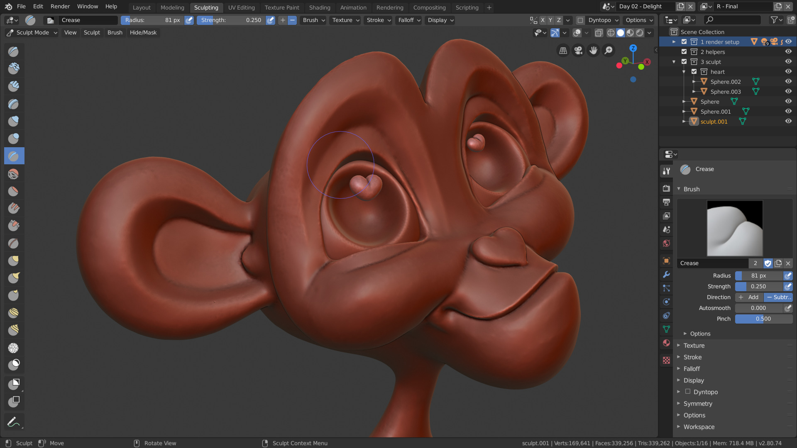
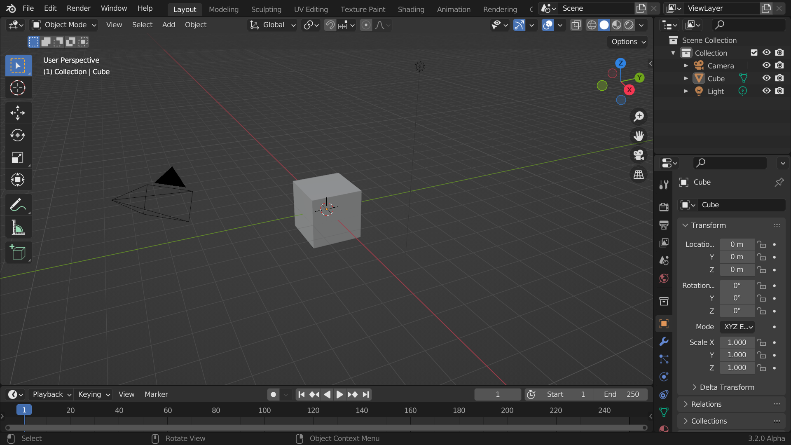
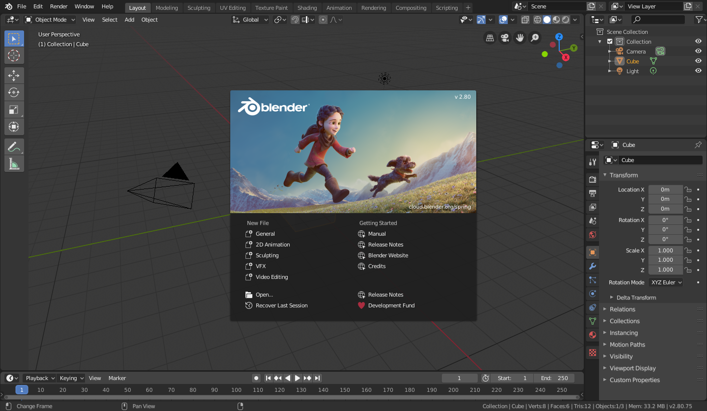
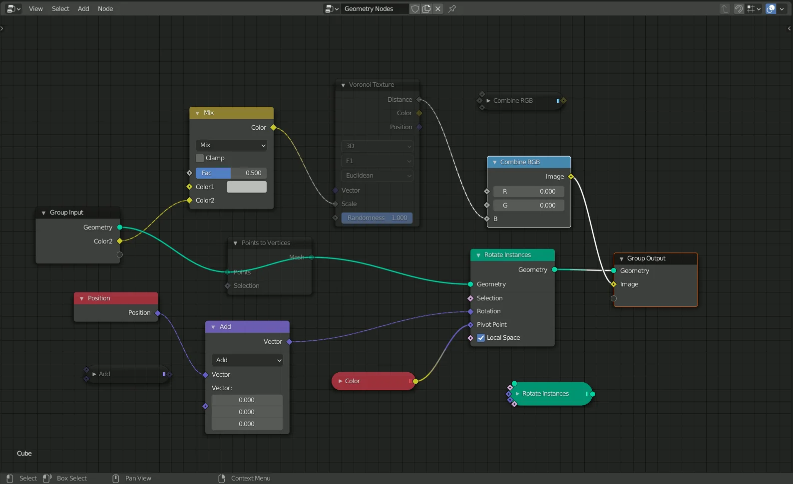

# Blender

Valenta

---

## Co je to Blender?

- **Blender** je výkonný a open-source 3D tvorivý balík.
- Používá se pro modelování, sochařství, texturování, osvětlování, renderování, animaci a další.
- Podporuje širokou škálu funkcí pro umělce, designéry a vývojáře.

---

## Klíčové vlastnosti

### Modelování:
   - ###### Vytvářejte 3D modely pomocí různých nástrojů.
   - ###### Úprava sítí, sochařství a další.

### Animace:
   - ###### Rigging, animace klíčových snímků a animace postav.

---

## Renderování:
   - ###### Vysokokvalitní renderování s motory Cycles a Eevee.

## Texturování a stínování:
   - ###### UV mapování, procedurální textury a vytváření materiálů.

---

## Uživatelské rozhraní

- Blender má jedinečné, ale výkonné rozhraní.
- Sestává z 3D pohledů, editoru vlastností, časové osy a dalších prvků.

---

## Demo: Vytvoření jednoduchého objektu

Vytvořme společně základní 3D objekt.

1. Otevřete Blender a vyberte výchozí kostku.
2. Přejděte do režimu úprav (`Tab` klávesa) a manipulujte s vrcholy.
3. Přidejte nový primitivní tvar (např. koule).
4. Aplikujte materiály a zobrazte scénu.

---

## Pokročilé funkce

1. **Částicové systémy:**
   - Simulujte vlasy, srst, kouř a další.

2. **Fyzikální simulace:**
   - Realistické simulace pro kapaliny, látky a měkké/tvrdé tělesa.

3. **Skriptování a doplňky:**
   - Rozšiřte funkčnost Blenderu pomocí skriptování v Pythonu.

---

## Závěr

- Blender je všestranný nástroj pro tvorbu.

### Děkuji za vaši pozornost!

---

## Otázky a odpovědi

Zeptejte se na cokoli.