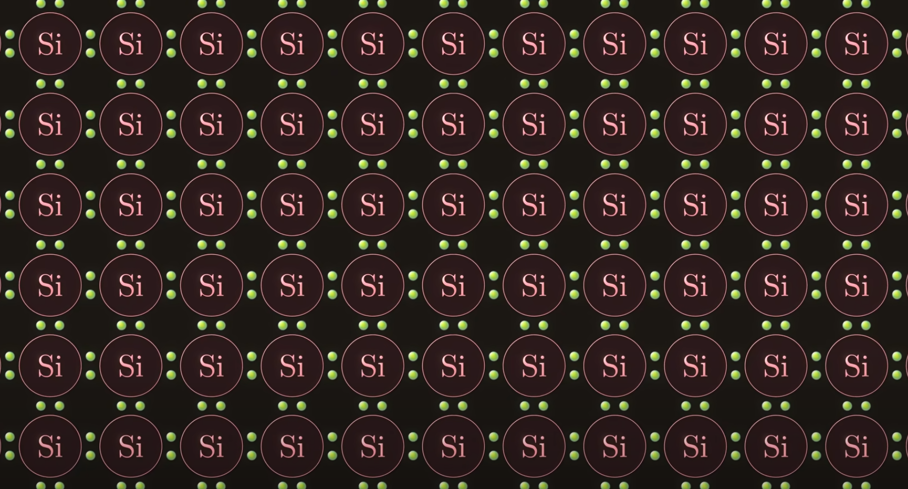
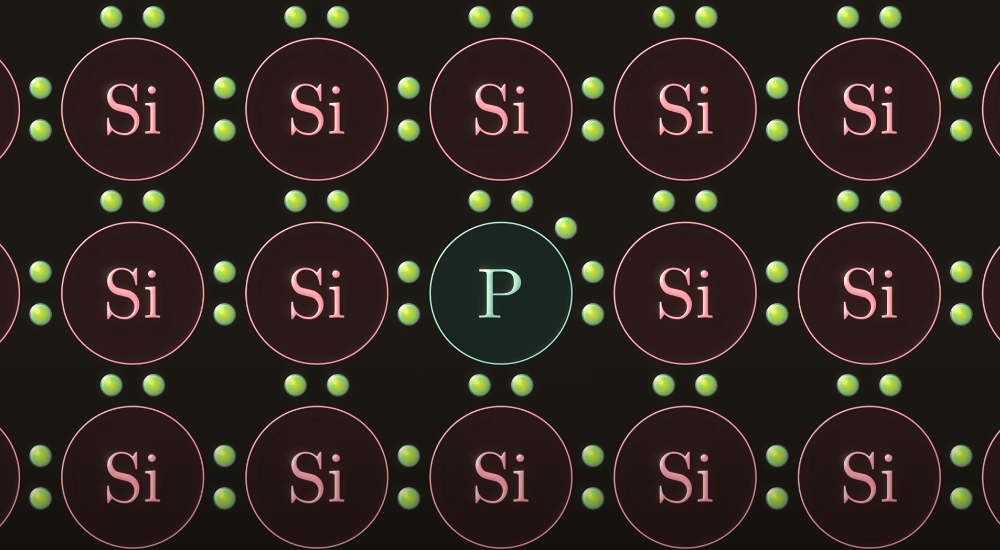
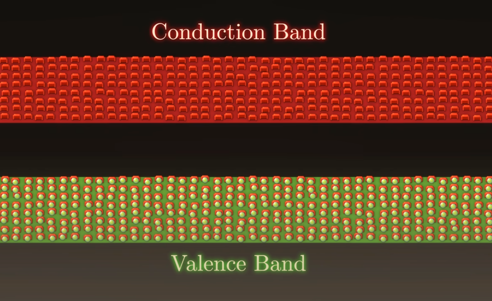
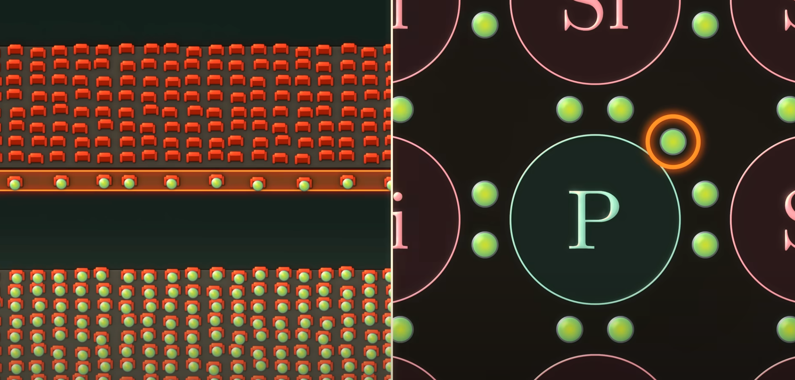
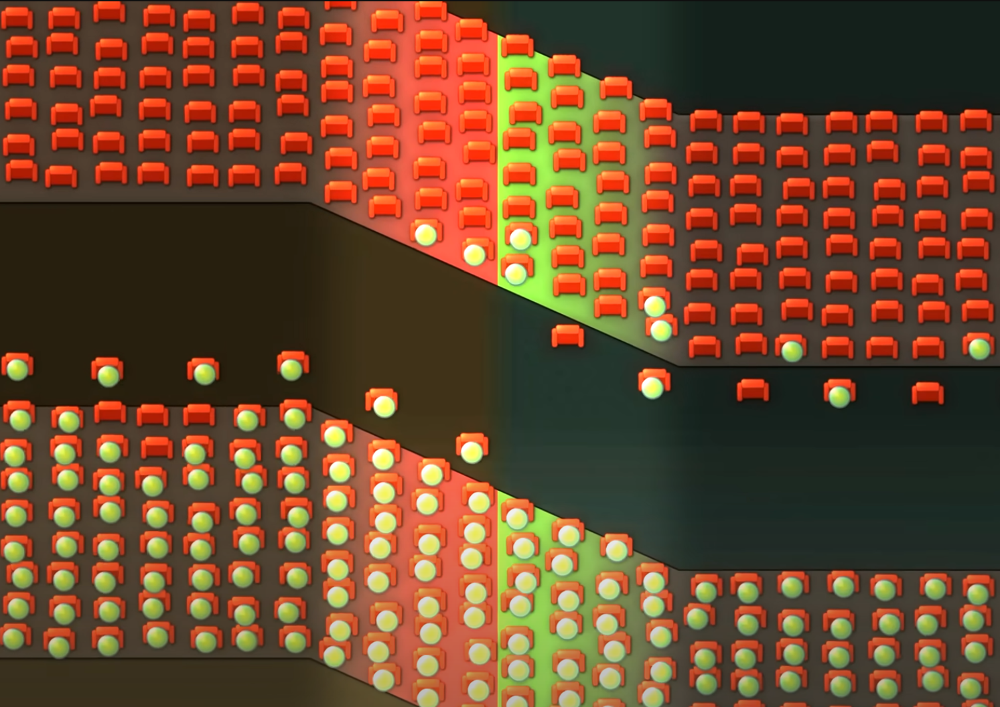

# Shuji Nakamura

---

# Fungování Led
(Dioda vyzařující světlo)

---

# Základní vazba

---

---

---

---

---

Dioda taková, že světlo vyzařované na p-n přechodu je úměrné předpínacímu proudu.

3M $
2014 Nobelova cena za fyziku
Narozen	22. května 1954, Ikata, Ehime, Japonsko
Nichia
PhD
Nitridy galia

7 ráno přijít do laboratoře
7:00-13:00 sváření přistoje
13:00-19:00 experimentování s ním
19:00 jít domů, jíst, spát

bez víkendů a svátků rok a půl

víroba P typu

víhra

dát další trisku do přístroje

---

# Zpětná vazba a děkuji za pozornost
＜（＾－＾）＞🤍
