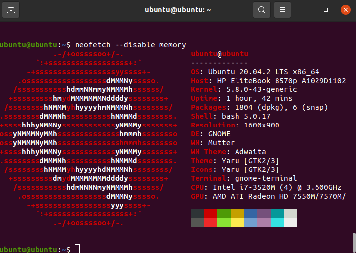
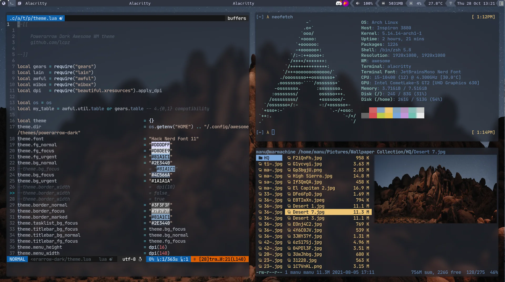
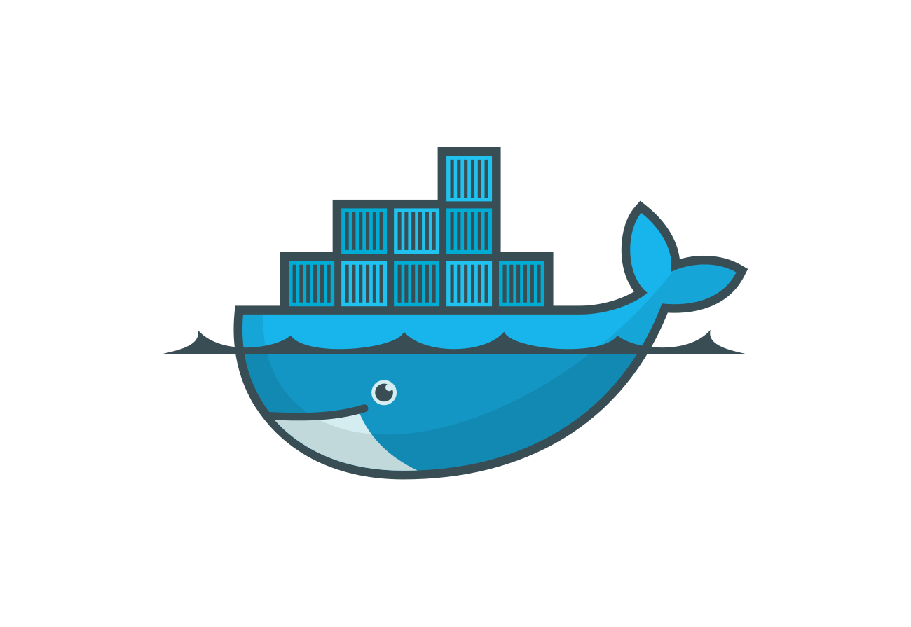
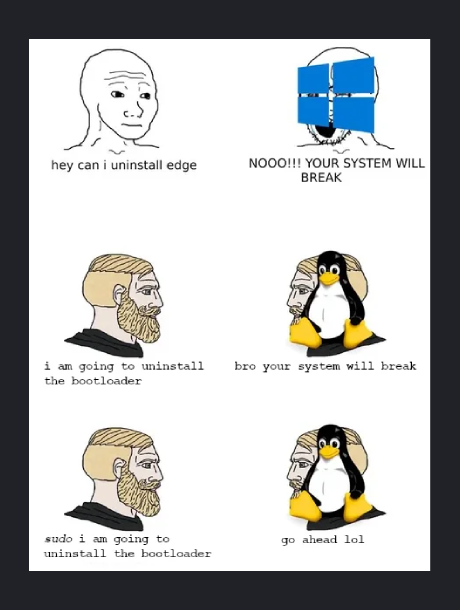

# GNU/Linux

###### A proč jsme ve všem nejlepší.

Valenta Zahradník Novotný 
Zapletal Janoštík

---

# Úvod do Linuxu:

- Definice
- Linus a Stallman
- Klíčové charakteristiky
- Důležitost

---

# Otevřený zdroj a komunita:

- Filozofie otevřeného zdroje
- Komunitní vývoj

---

# Rozmanitost distribucí:

- Přehled distribucí
- Přizpůsobení

---

# Příkazový řádek (CLI):

- Silný shell
- Skriptování a automatizace

---

# Bezpečnost a stabilita:

- Bezpečnostní model
- Stabilita

---

# Správa balíčků:

- Systémy balíčků
- Rozlišování závislostí

---

# Aplikace pro servery:

- Webové servery
- Databázové servery

---

# Desktopová prostředí:

- Možnosti desktopu
- Dostupnost softwaru

---

# Kontejnerizace a virtualizace:

- Živé prostředí
- Kontejnery
- Virtualizace

---

# Budoucí trendy:

- Cloud Computing
- Kontejnery a mikroslužby

---

# Závěr:

- Shrnutí
- Všestrannost
- Trvající inovace

---

# Otázky pro ostatní OS

---

