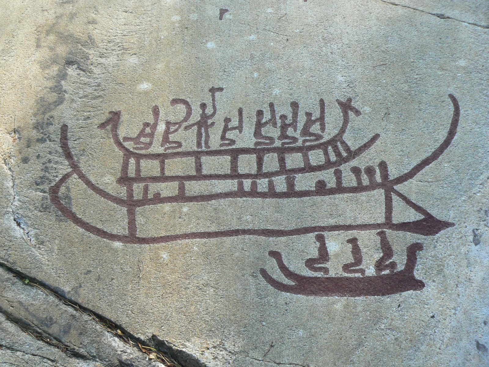
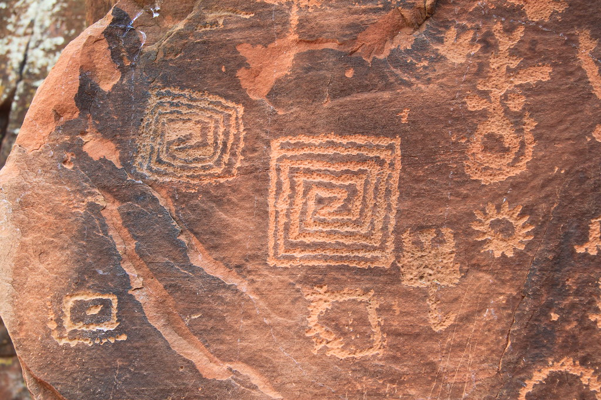
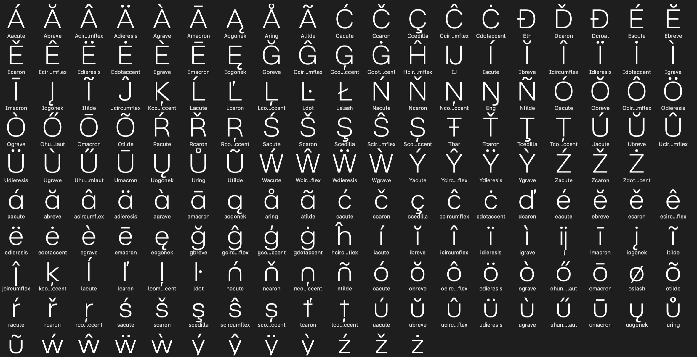
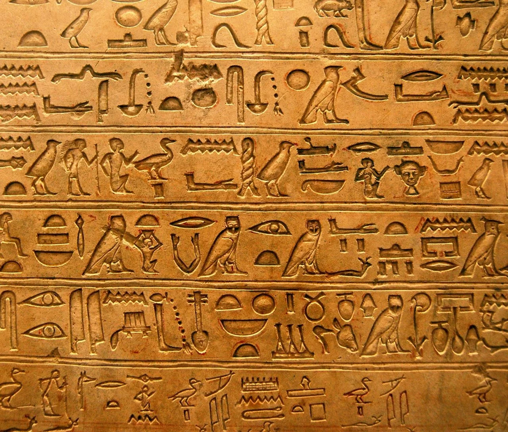
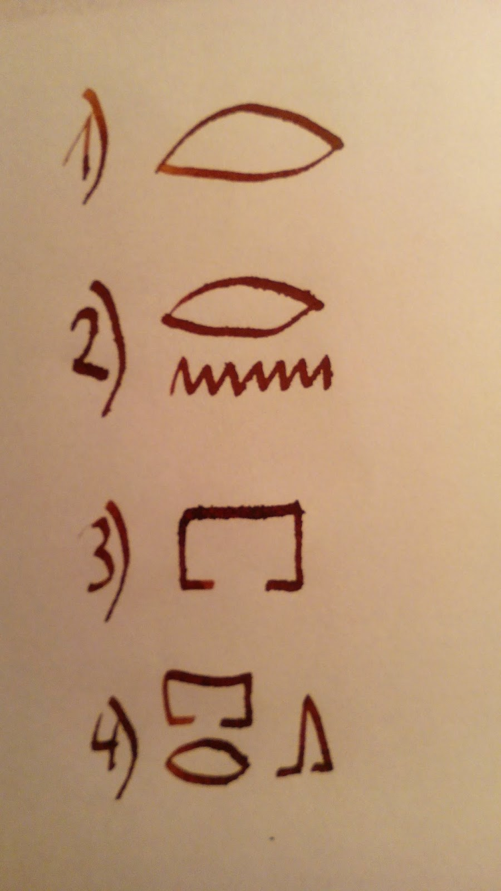
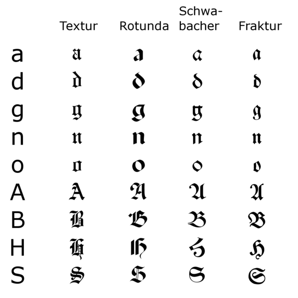
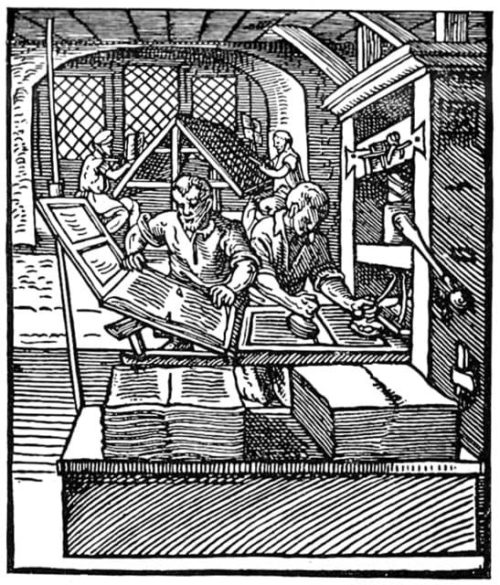

# Historie písma

Valenta

český jazyk prezentace

---

# Účel používání písma:
- Zaznamenáváné informacé dalším generacím.
- První písma se objevily s potřebou vést účetnictví.

---

# Předchůdci písma:
- Mnemografy: Jednoduché značky nebo symboly používané pro paměťovou podporu.

---

   - Piktogramy

   - Petroglyfy

   - Geoglyfy

   - Ideogramy

   

[//]: # (Piktogramy: Obrazové znázornění objektů, které slouží ke komunikaci. Petroglyfy: Vyryté symboly nebo obrazy na kamenných površích Geoglyfy: Zeměpisné tvary nebo symboly vytvořené na krajině. Ideogramy: Symboly reprezentující myšlenky nebo koncepty.)

---

# Dělení písma:
- Pojmové písmo: Každý symbol reprezentuje celý pojem nebo slovo.
   - Slabičné: Symboly reprezentují slabiky.
   - Hláskové: Každý symbol reprezentuje zvuk nebo.

---

# Písmo starověkých říší:
- Egypt: Hieroglyfy používané v období starověkého Egypta.

---

# Dělení hieroglifů:

- Logogramy

- Fonetické znaky

- Determinativy

- Kombinace

---

- Mezopotámie: Klínové písmo v Sumeru a Akkadu.

- Řím a Řecko: Latinka a řecká abeceda.

- Středověká Evropa: Rozvoj unciálového a karolinského písma.

---

# Vývoj písma u nás
- Cyrilice a glagolice
- Vyšehradský kodex jako příklad staroslověnského písma.
- Latinka v souvislosti s vlivem římské kultury.

---

# Současnost:
- Digitalizace písma
- Unicode a standardizace písma pro globální komunikaci.
- Různé písmové styly a trendy ve výtvarném umění a designu.

---

