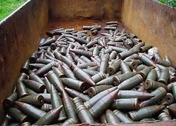
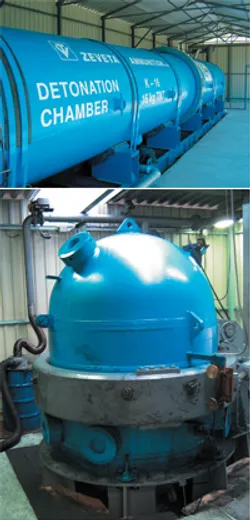
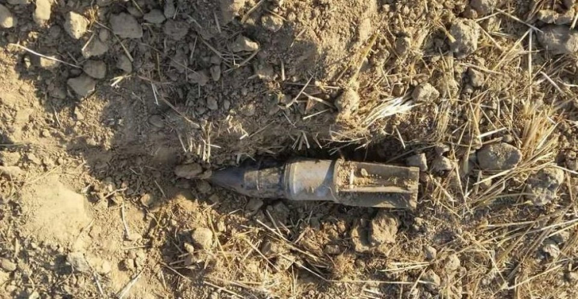

# Odpad z munice

Valenta

```
ZSV prezentace
```

---

## Jak konkrétně tento typ odpadu poškozuje životní prostředí?



---

## Jakým způsobem se nyní s tímto odpadem nakládá?



---

## Pokud se recykluje, jaké jsou produkty recyklace?



---

# Zpětná vazba