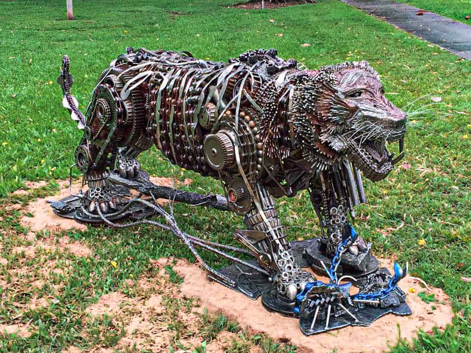
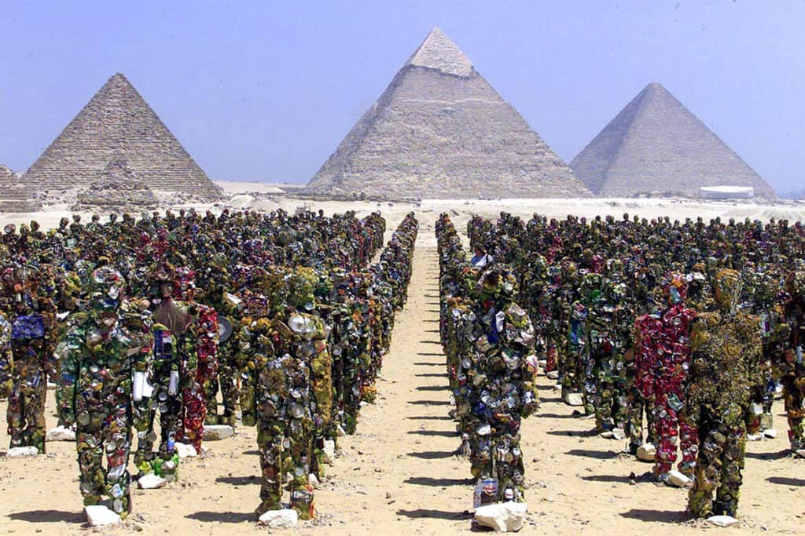
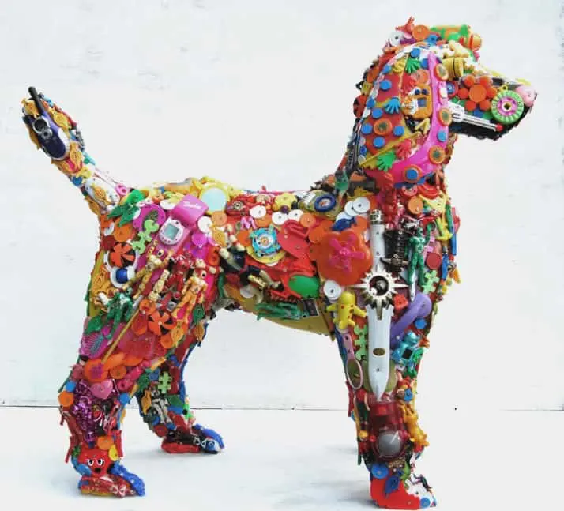
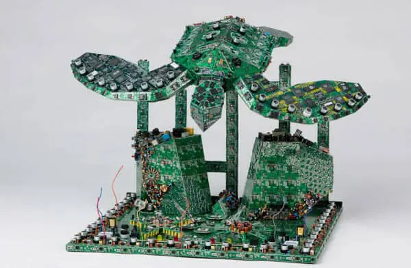

# Scrap sculptures

Valenta
Zahradník
Matoušek
Dorda
Kašpárek

---

## Barefooted Welder | Scrap metal sculptor from Australia

---

# HA Schult | Sculptures made out of garbage

---

# Robert Bradford | Sculptures made out of recycled toys

---

## Steven Rodrig | PCB sculptures using discarded electronics

---

#### Located in Kovozoo, 2 ton Rhino named Norbert, the heaviest animal in Kovozoo out of all 400+ animals

---

# After unveiling Stella the Seahorse – a 1,600-pound sculpture made entirely of plastic ocean debris

